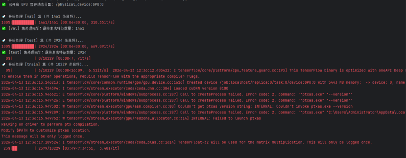
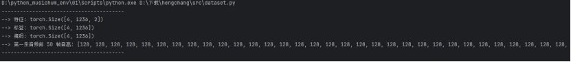

没问题！将这两周的工作分开写，不仅逻辑更清晰，也更符合标准的项目周报格式。这样你在向导师或项目组汇报时，能够精准展现每一周的攻坚重点。

以下为你拆分并整理的**第五周**和**第六周**独立工作报告：

------

# 📄 第五周工作报告：数据增强与 PyTorch 数据管道构建

**汇报人：** 钟翔

**日期：** 2026-04-05

**项目阶段：** 数据工程与 DataLoader 构建

## 一、 工作完成情况综述

本周的核心任务是彻底打通从“底层音频特征”到“PyTorch 模型张量”的供水管道，并完成训练数据的规模化扩充。

1. **离线数据扩充 (Data Augmentation)**

   - 在特征提取阶段引入动态数据增强策略。
   - **音高偏移**：实现 $\pm2$ 半音的偏移，模拟不同用户的音域和跑调情况。
   - **时间拉伸**：实现 $\pm10\%$ 的速度变换，模拟不稳定的哼唱节奏。
   - **成果**：将原始约 2000 条音频，成功扩充至 **6414 条**有效训练特征，超额达成 $\ge 6000$​ 条的项目指标。

   

2. **构建训练数据管道 (DataLoader)**

   - 编写 `dataset.py`，实现 `HumTransFeatureDataset` 类，直接读取 `.npy` 高级特征矩阵，极大地解放了 CPU 和 I/O 瓶颈。
   - 自定义 `pad_collate` 批处理函数：针对哼唱音频长度不一的特点，实现序列动态补齐（Padding）。
   - 设定 `batch_size=32`，并同步生成掩码（Mask）矩阵，为后续 CRF 层的训练做好数据准备。

## 二、 遇到的困难与处理结果

| **遇到困难**           | **问题分析**                                                 | **解决方法**                                                 | **处理结果**                                                 |
| ---------------------- | ------------------------------------------------------------ | ------------------------------------------------------------ | ------------------------------------------------------------ |
| **特征与标签维度脱节** | CREPE 提取的特征是固定帧率（如每10ms一帧），而真实的 MIDI 标签是时间段事件（如 1.2s-2.5s 播放 C4），两者在时空上无法直接计算 Loss。 | 引入 `pretty_midi` 库，编写对齐解析脚本，按照特征帧率（100帧/秒）将 MIDI 事件“压扁”，映射为等长的逐帧音高数组（空拍用 128 填充）。 | 成功实现 (Batch, Max_Len, 2) 特征与 (Batch, Max_Len) 标签的 100% 严格对齐。 |

## 三、 最终执行结果 (验证截图)

运行 DataLoader 测试脚本，批处理与维度对齐均表现完美：

