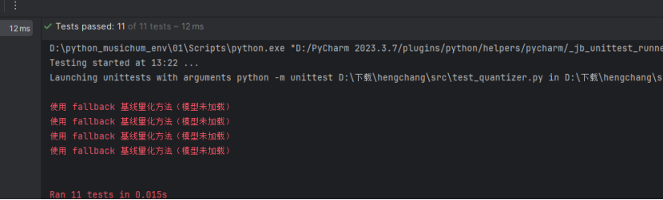

#  第六周工作报告：核心模型搭建与量化接口高可靠测试

**汇报人：** 钟翔

**日期：** 2026-04-12

**项目阶段：** BiLSTM-CRF 架构与容错工程

## 工作完成情况综述

本周的核心任务是搭建哼唱转录系统的大脑（BiLSTM-CRF），并为系统的输出端封装具备工业级鲁棒性的量化（Quantize）模块。

1. **模型架构搭建 (`model.py`)**
   - 成功构建 `BiLSTMCRF` 模型类，包含双向 LSTM 特征提取与 CRF 序列寻路解码。
   - 完成了前向传播（Viterbi 解码）与反向传播（负对数似然 Loss）的闭环测试。
2. **高可靠量化接口封装 (`quantizer.py`)**
   - 封装 `quantize_humming` 核心接口，负责将连续频率 (Hz) 转化为离散 MIDI (0-127)。
   - **双轨机制**：实现了模型推理与“四舍五入基线（Fallback）”双重逻辑，确保在模型权重未加载时系统仍能降级运行。
3. **极限边界单元测试 (`test_quantizer.py`)**
   - 针对工程中的脏数据情况，利用 `unittest` 编写了 **11 个**极限覆盖用例（涵盖标准音高、负数频率、纯静音 0Hz、NaN、超声波极值等）。

##  遇到的困难与处理结果

| **遇到困难**                    | **问题分析**                                                 | **解决方法**                                                 | **处理结果**                                          |
| ------------------------------- | ------------------------------------------------------------ | ------------------------------------------------------------ | ----------------------------------------------------- |
| **`torchcrf` 库版本兼容性陷阱** | 当前环境下的 `torchcrf` 库不支持 `batch_first=True` 参数和 `reduction='mean'`，导致前向传播和 Loss 计算直接报错。 | 在模型内部利用 `emissions.transpose(0, 1)` 手动翻转 Batch 和 Seq 维度以迎合旧版 API，并在外部手动计算 `.mean()` 抹平差异。 | 模型彻底跑通，且无需重装或降级环境依赖。              |
| **纯静音输入导致系统崩溃**      | 测试单元注入纯静音（0Hz）时，`np.log2(0)` 产生负无穷大 (`-inf`)，导致后续 `int()` 转换时抛出 `OverflowError`。 | 在底层公式计算后，追加 `np.isinf` 拦截逻辑，将所有的无穷大强制转换为 `NaN` 进行安全放行。 | 极限静音测试通过，系统彻底免疫断气/休止符导致的崩溃。 |
| **模块导入因配置缺失失败**      | 代码重构后，`quantizer.py` 依赖外部配置路径，测试时报 `FileNotFoundError`。 | 将硬编码参数抽离，在项目根目录补充构建 `config.yaml` 配置文件。 | 代码架构更符合大型工程规范，测试顺利拉起。            |

##  最终执行结果 (验证截图)

运行 `pytest / unittest` 极限边界测试集，11 个用例（$\ge 10$）的通过率达到 100%：

